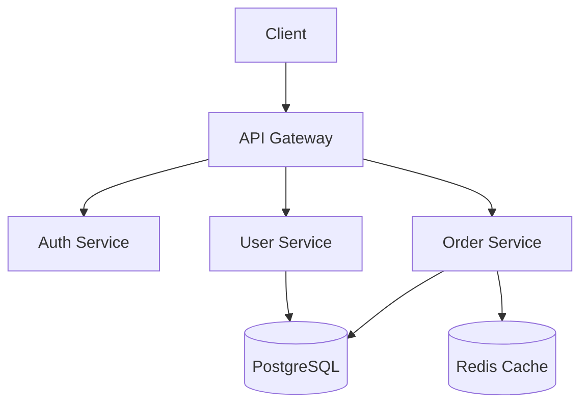

# Architecture Mapping

## Layer Identification

Detect architectural layers by examining directory names, import patterns, and responsibility separation.

### Common Layer Patterns

```
┌─────────────────────────────────────┐
│  Presentation / API Layer           │  routes/, controllers/, pages/,
│  (HTTP handlers, CLI, UI)           │  views/, components/, handlers/
├─────────────────────────────────────┤
│  Application / Service Layer        │  services/, use-cases/, commands/,
│  (Business logic orchestration)     │  application/, interactors/
├─────────────────────────────────────┤
│  Domain Layer                       │  domain/, models/, entities/,
│  (Core business rules)             │  core/, types/
├─────────────────────────────────────┤
│  Infrastructure / Data Layer        │  repositories/, database/, infra/,
│  (DB, external APIs, messaging)     │  adapters/, clients/, persistence/
└─────────────────────────────────────┘
```

### Detection Commands

```bash
# Identify layer directories
find . -maxdepth 3 -type d | grep -iE \
  'route|control|handler|view|page|component|service|domain|model|entity|repo|database|infra|adapter'

# Check import direction (should flow downward: presentation → service → domain → infra)
grep -rn "import.*controller\|from.*controller" --include="*.ts" --include="*.py" | head -10
grep -rn "import.*service\|from.*service" --include="*.ts" --include="*.py" | head -10
grep -rn "import.*repository\|from.*repository" --include="*.ts" --include="*.py" | head -10
```

## Module Boundary Analysis

Identify cohesive units of code that form logical modules.

### Boundary Indicators

| Indicator | Detection |
|-----------|-----------|
| Package/directory with public API | `index.ts`, `__init__.py`, `mod.rs` |
| Shared types or interfaces | `types.ts`, `interfaces/`, `contracts/` |
| Configuration isolation | Separate config per module |
| Independent test directory | Tests colocated or mirrored per module |
| Feature directories | `features/auth/`, `features/orders/` |

```bash
# Feature-based organization detection
find . -maxdepth 2 -type d -name 'features' -o -name 'modules' -o -name 'domains'

# Module public API surface (barrel exports)
find . -name 'index.ts' -not -path '*/node_modules/*' | while read f; do
  echo "=== $f ==="
  grep "export" "$f" | head -10
done

# Python package public APIs
find . -name '__init__.py' -not -path '*/venv/*' | while read f; do
  [ -s "$f" ] && echo "=== $f ===" && grep "from\|import\|__all__" "$f" | head -10
done
```

## Entry Point and Routing Analysis

Map how requests enter the system and how they are dispatched.

```bash
# REST API routes
grep -rn "app\.\(get\|post\|put\|patch\|delete\)\|@app\.route\|@router\.\(get\|post\)" \
  --include="*.py" --include="*.ts" --include="*.js" | head -30

# Express/Fastify route registration
grep -rn "app\.use\|router\.use" --include="*.ts" --include="*.js" | head -20

# Go HTTP handlers
grep -rn "HandleFunc\|Handle\|mux\.\|gin\.\|echo\." --include="*.go" | head -20

# GraphQL schema/resolvers
find . -name '*.graphql' -o -name '*.gql' -o -name 'schema.*' | head -10
grep -rn "Query\|Mutation\|Resolver" --include="*.ts" --include="*.py" | head -20
```

## Data Flow Tracing

Follow a request from entry to data store and back.

### Trace Methodology

1. Start at the route/handler that matches the endpoint
2. Follow the function call chain through service/use-case layer
3. Identify data transformations (DTOs, mappers, serializers)
4. Track database queries or external API calls
5. Follow the response path back to the client

```bash
# Find data transformation layers
find . -type d -name 'dto' -o -name 'mappers' -o -name 'serializers' -o -name 'schemas'
grep -rn "class.*DTO\|class.*Schema\|class.*Mapper\|class.*Serializer" \
  --include="*.ts" --include="*.py" | head -20

# Database query locations
grep -rn "\.query\|\.execute\|\.find\|\.create\|\.update\|\.delete" \
  --include="*.ts" --include="*.py" | grep -iv "test\|spec\|mock" | head -20
```

## Service Boundary Detection

For multi-service architectures, identify how services communicate.

```bash
# HTTP client usage (service-to-service calls)
grep -rn "fetch(\|axios\.\|httpClient\.\|requests\.\(get\|post\)" \
  --include="*.ts" --include="*.py" | grep -iv "test" | head -20

# Message queue / event bus usage
grep -rn "publish\|subscribe\|emit\|kafka\|rabbitmq\|nats\|redis.*pub" \
  --include="*.ts" --include="*.py" --include="*.go" | head -20

# gRPC service definitions
find . -name '*.proto' | head -10

# API contract files
find . -name 'openapi*' -o -name 'swagger*' -o -name '*.proto' -o -name 'schema.graphql'
```

## Architecture Diagram Generation

Produce text-based diagrams from analysis findings. Use ASCII for simple structures, Mermaid for complex relationships.

### Quick ASCII Template

```
┌──────────┐    ┌──────────┐    ┌──────────┐
│  Client   │───▶│  API GW   │───▶│  Auth    │
└──────────┘    └──────────┘    └──────────┘
                      │
                ┌─────┴─────┐
                ▼           ▼
          ┌──────────┐ ┌──────────┐
          │  Orders  │ │  Users   │
          └────┬─────┘ └────┬─────┘
               │            │
               ▼            ▼
          ┌──────────────────────┐
          │     PostgreSQL        │
          └──────────────────────┘
```

### Mermaid Component Diagram



## References

- [Architecture Patterns](references/architecture-patterns.md) — Detection heuristics for Layered, Clean Architecture, Hexagonal, Microservices, Event-Driven, and Monorepo patterns.
- [Diagramming Techniques](references/diagramming-techniques.md) — ASCII box diagrams, Mermaid syntax for component, sequence, and class diagrams, dependency graphs.
