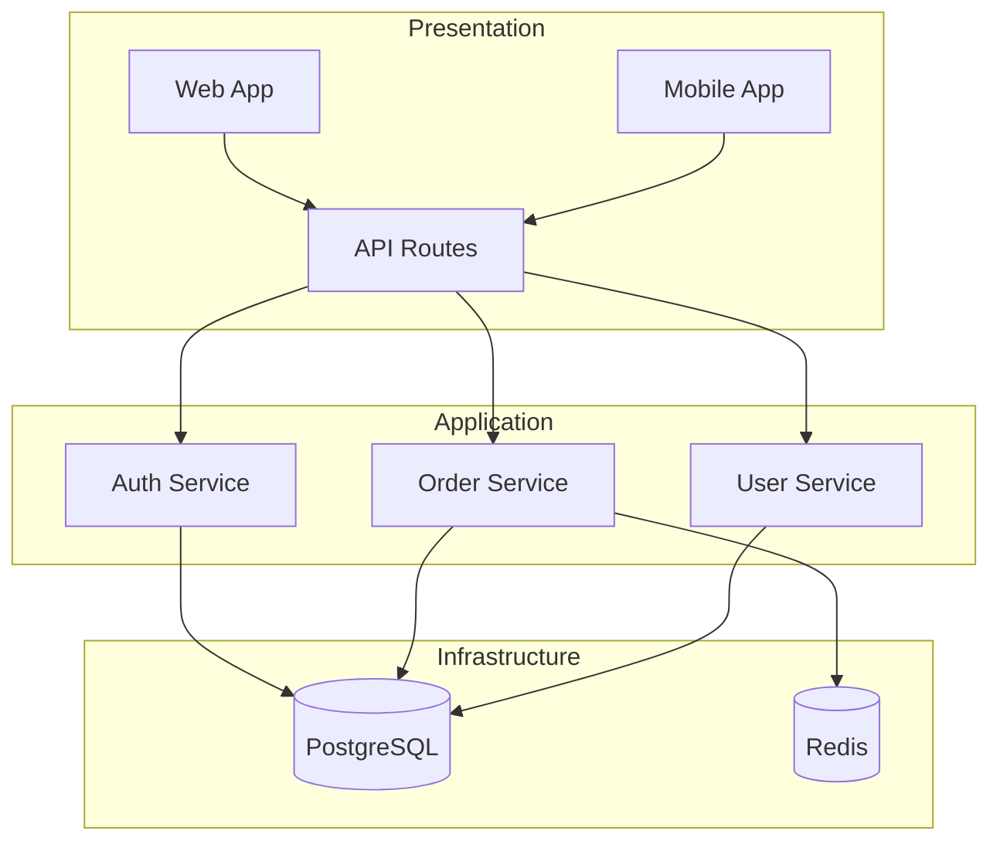
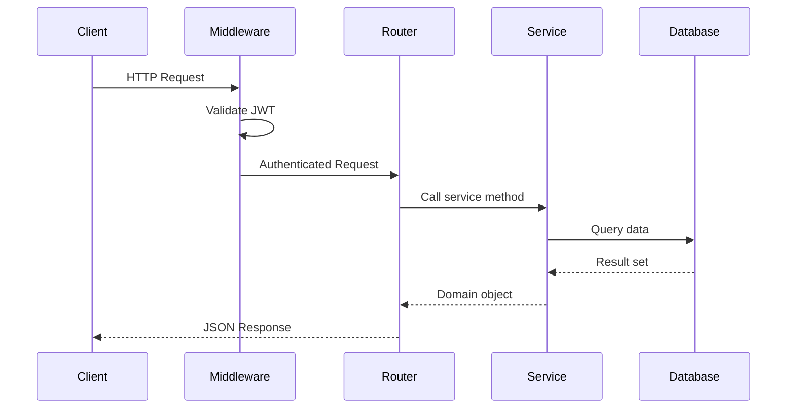
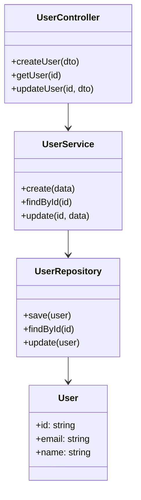
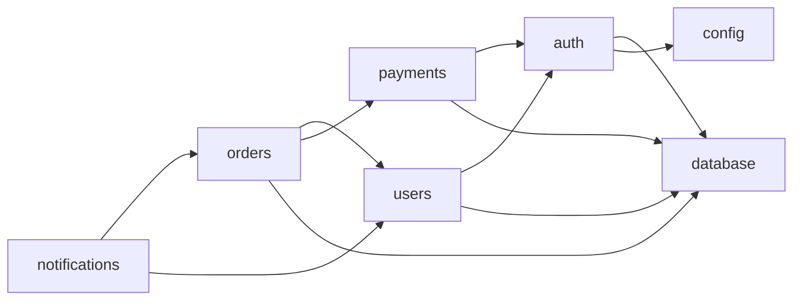
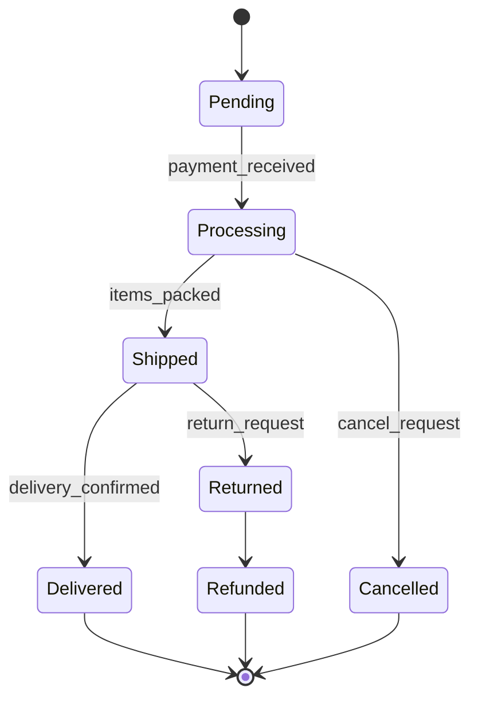
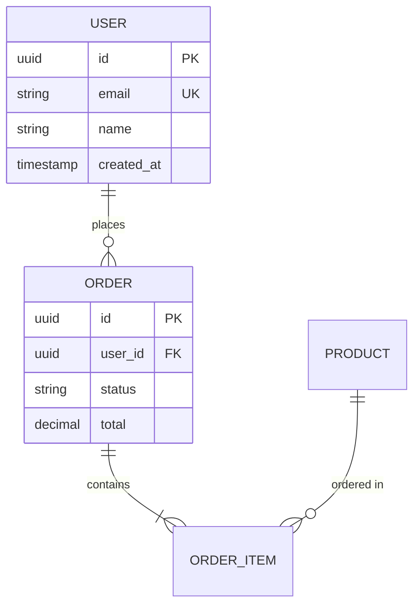

# Diagramming Techniques

## ASCII Box Diagrams

### Layer Diagram

```
┌─────────────────────────────────────────────────┐
│                 Presentation Layer                │
│  ┌──────────┐  ┌──────────┐  ┌──────────────┐  │
│  │  Routes   │  │  Views   │  │  Middleware   │  │
│  └──────────┘  └──────────┘  └──────────────┘  │
├─────────────────────────────────────────────────┤
│                 Application Layer                │
│  ┌──────────────┐  ┌────────────────────────┐   │
│  │  Use Cases    │  │  Application Services  │   │
│  └──────────────┘  └────────────────────────┘   │
├─────────────────────────────────────────────────┤
│                  Domain Layer                    │
│  ┌──────────┐  ┌──────────┐  ┌──────────────┐  │
│  │ Entities  │  │  Values  │  │  Domain Svc  │  │
│  └──────────┘  └──────────┘  └──────────────┘  │
├─────────────────────────────────────────────────┤
│               Infrastructure Layer               │
│  ┌──────────┐  ┌──────────┐  ┌──────────────┐  │
│  │ Database  │  │  Cache   │  │  External API │  │
│  └──────────┘  └──────────┘  └──────────────┘  │
└─────────────────────────────────────────────────┘
```

### Service Communication Diagram

```
┌──────────┐         ┌──────────┐         ┌──────────┐
│  Client   │──HTTP──▶│  Gateway  │──HTTP──▶│  Auth    │
└──────────┘         └────┬─────┘         └──────────┘
                          │
                    ┌─────┴─────┐
                    │           │
              ┌─────▼────┐ ┌───▼──────┐
              │  Orders  │ │  Users   │
              └────┬─────┘ └────┬─────┘
                   │            │
              ┌────▼────────────▼────┐
              │      PostgreSQL       │
              └──────────────────────┘
```

### Data Flow Diagram

```
Request ──▶ [Auth Middleware] ──▶ [Route Handler] ──▶ [Service]
                                                        │
                                                   [Repository]
                                                        │
                                                   [Database]
                                                        │
                                                   [Repository]
                                                        │
Response ◀── [Serializer] ◀──── [Service] ◀──── [Domain Entity]
```

### ASCII Building Blocks

```
Boxes:      ┌──────────┐    ╔══════════╗
            │  Normal   │    ║  Double   ║
            └──────────┘    ╚══════════╝

Arrows:     ──▶  ◀──  ──▷  ◁──  ───  │  ──┐
                                          │
                                          ▼

Connectors: ┌──┬──┐    ├──┼──┤    └──┴──┘
```

## Mermaid Diagrams

### Component Diagram



### Sequence Diagram — Request Lifecycle



### Class/Module Relationship Diagram



### Dependency Graph



### State Diagram



### Entity Relationship Diagram



## Dependency Graph Visualization

### Module Dependency Matrix

```
              auth  users  orders  payments  notifications
auth           -      -      -       -           -
users          ✓      -      -       -           -
orders         -      ✓      -       ✓           -
payments       ✓      -      -       -           -
notifications  -      ✓      ✓       -           -
```

Read as: row depends on column. Example: `orders` depends on `users` and `payments`.

### Generating Dependency Data

```bash
# Extract imports per module and build adjacency list
for dir in src/*/; do
  module=$(basename "$dir")
  deps=$(grep -rh "from '\.\./\|from \"\.\./" "$dir" --include="*.ts" 2>/dev/null \
    | sed "s/.*from ['\"]\.\.\/\([^/]*\).*/\1/" | sort -u | tr '\n' ',')
  echo "$module -> $deps"
done

# Python version
for dir in src/*/; do
  module=$(basename "$dir")
  deps=$(grep -rh "from \.\." "$dir" --include="*.py" 2>/dev/null \
    | sed 's/from \.\.\([a-zA-Z_]*\).*/\1/' | sort -u | tr '\n' ',')
  echo "$module -> $deps"
done
```

## Best Practices

1. **Start simple** — Use ASCII for quick inline diagrams, Mermaid for documentation
2. **Label connections** — Always annotate arrows with the communication type (HTTP, gRPC, events)
3. **Show direction** — Dependency arrows should point from dependent to dependency
4. **Group by concern** — Use subgraphs/boxes to group related components
5. **Include data stores** — Always show databases, caches, and queues
6. **Keep it readable** — Max 15-20 nodes per diagram; split complex systems into multiple views
